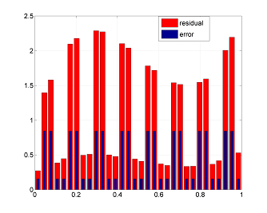
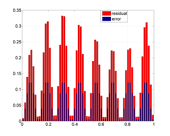
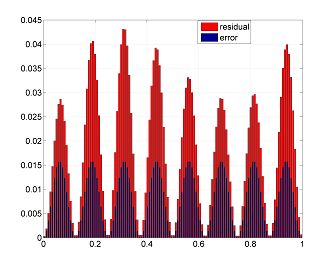
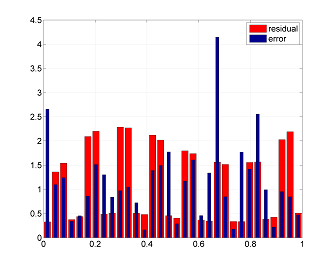
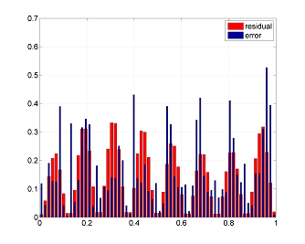
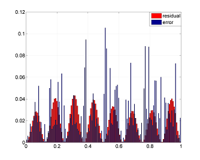

# A posteriori Error Estimates for Numerical Solutions of PDEs

## Explicit Residual Method 1D

Let $u(x) \in H^1\left([0, 1]\right)$ is the solution of the problem
$$ \left( \alpha u' \right)' + f = 0,\, x \in \left[0, 1\right], $$
$$ u(0) = U_0,\, u(1) = U_1, $$
where $\alpha(x) \ge \alpha_0 > 0,\, f \in L^2\left([0, 1]\right)$.

A Galerkin approximation $u_h$ is in the space $V_h$ - finite-dimensional subspace of $H^1\left([0, 1]\right)$, i.e $u_h$ is the function satisfying the integral identity  
$$ \int\limits_0^1 \alpha u_h' w_h ' dx = \int\limits_0^1 f w_h dx ,\, \forall w_h \in V_h $$

_Code block 1D_ numerically shows the validity of the inequality relating the approximation error to the residual
$$	\alpha_0\Vert u' - u_h' \Vert^2 \le
	\left(\frac{h}{\pi}\right)^2 \Vert (\alpha u_h')' + f \Vert^2, $$
where $\Vert \cdot \Vert$ is norm in $L^2(0, 1)$.
It is also shown that the inequality is violated if the approximation $u_h$ is non-Galerkin.
Next denote the left side of the inequality by $e$, and the right side by $r$. 

