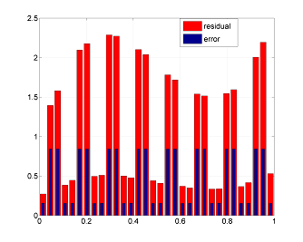
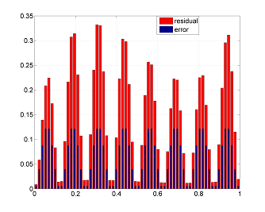

# A Posteriori Estimates for Finite Element Approximations

## Explicit Residual Method in a 1D Problem

### Problem Formulation
Let $u(x) \in H^1\left([0, 1]\right)$ is the solution of the problem
$$ \left( \alpha u' \right)' + f = 0,\, x \in \left[0, 1\right], $$
$$ u(0) = U_0,\, u(1) = U_1, $$
where $\alpha(x) \ge \alpha_0 > 0,\, f \in L^2\left([0, 1]\right)$. <br>

Code block _1D_ numerically shows the validity of the inequality relating the error of the Galerkin approximation $u_h$ to the residual [[1]](#1)
$$	\alpha_0\Vert u' - u_h' \Vert^2 \le
	\left(\frac{h}{\pi}\right)^2 \Vert (\alpha u_h')' + f \Vert^2, $$
where $\Vert \cdot \Vert$ is norm in $L^2(0, 1)$. <br>


<!-- TODO: uncomment when the report will be published. -->
<!-- The sourse [[2]](#2) also has detals and a numerical example. -->

### How to use
User can vary parameters in the section 'setting of research params':
- N is the number of intervals for discretisation (for example, in figures above N = 32 and N = 64);
- flag_Gal_approx is a flag that allows to make the approximation $u_h$ non-Galerkin (in this case the inequality is violated);
- frac_val is parameter for variate the noise level in $u_h$ (non-Galerkin solution).
```matlab
%% setting of research params
N = 128;
flag_Gal_approx = false;
frac_val = 0.015;
```

## Methods Based upon Post-processing of Finite Element Approximations

### Problem Formulation
The function $u \in \mathring{H}^1(\Omega)$ is the solution to the problem
$$ \Delta u + f = 0 \textrm{ in } \Omega \subset \mathbb{R}^2, $$
$$u \vert_{\partial \Omega} = 0 ,$$
where function $f \in L^2(\Omega)$.

Let $u_h$ here also be the Galerkin approximation, it was calculated on the meshgrid of finite elements $\{ T_i \}_{i=1}^N$.

The indicator of the error is a field constructed by a vector function $\boldsymbol{y}$ and defined on each finite element $T_i$ as
$$ \Vert \nabla u_h - \boldsymbol{y} \Vert_i^2 $$

Two indicators are described below.

### Averaging Gradient
This method uses gradient of a numerical solution ($\nabla u_h$) and involves averaging this function over a patch (a set of elements with a common vertex) over the entire mesh; and, finnaly, $\boldsymbol{y}$ is a  piecewise affine continuation of the resulting function. See more details in [[1]](#1).
<!-- TODO: uncomment when the report will be published. -->
<!-- The sourse [[3]](#3) also has a numerical example. -->

### Minimizing the Majorant $M_+$
The approximation error estimate is [[1]](#1)
$$	\Vert \nabla (u - u_h) \Vert^2 \le M_+^2(u_h, \boldsymbol{y}, \beta), \quad \forall \boldsymbol{y} \in H(\Omega, \textrm{div}), \beta > 0, $$
where the following is true for the majorant $M_+$
$$	M_+^2(v, \boldsymbol{y}, \beta) = (1+\beta) \int\limits_{\Omega} \vert \nabla v - \boldsymbol{y} \vert^2 dx + \left(1+\frac{1}{\beta}\right) C_F^2 \int\limits_{\Omega} \vert \textrm{div} \boldsymbol{y} + f \vert^2 dx. $$
here $\Vert \cdot \Vert$ is the norm in $L^2(\Omega, \mathbb{R}^2)$, $C_F$ is the Friedrichs' constant.

The indicator $\boldsymbol{y}$, constructed by minimizing the majorant $M_+$, by definition is
$$ \boldsymbol{y} \,:\, \underset{{\boldsymbol{y}}, \beta > 0}{\textrm{min}} M_+^2(u_h, \boldsymbol{y},\beta). $$

### How to use
<!-- TODO: complete this subsection -->
```matlab
indr = ind_obj.getIndicator(projection_type);
figure
indr_m = Indicator.marker(indr);
ind_obj.plotFld(indr_m);
```

## References
<a id="1">[1]</a> 
P. Neittaanmaki and S. Repin. Reliable methods for computer simulation.
Error control and a posteriori estimates. Elsevier, NY, 2004
<!-- <a id="2">[2]</a> 
Explicit Residual Method in a 1D -->
<!-- <a id="3">[3]</a> 
Alexey Vasilyev. A posteriori Error Estimates for Numerical Solutions of PDEs. -->
