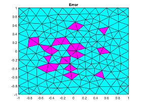
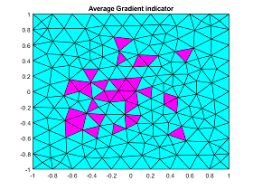
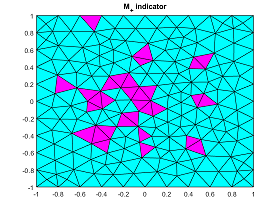

# A Posteriori Estimates for Finite Element Approximations

## Overview
The module provides a tool for estimating the error of a numerical solution of an elliptic PDE obtained using [__pdeModeler__](https://www.mathworks.com/help/pde/ug/pdemodeler-app.html).

The project also includes, as a separate submodule, a method for estimating the error for a 1D problem.

The entire module is developed based on the book [[1]](#1) authored by P. Neittaanmaki and S. Repin.

## Requirements and Limitations
<!-- TODO: write here about that the module works for model, exported from pdetool and about Friedrichs constant for rect -->
1D submodule requires __Curve Fitting Toolbox__.

The Indicator class requires the elliptic PDE problem parameters exported from __pdeModeler__.
The current release only supports the problem in the __rectangular domain__.

## Explicit Residual Method in a 1D Problem
### Problem Formulation
Let $u(x) \in H^1\left([0, 1]\right)$ is the solution of the problem

$$ \left( \alpha u' \right)' + f = 0, x \in \left[0, 1\right], $$

$$ u(0) = U_0, u(1) = U_1, $$

where $\alpha(x) \ge \alpha_0 > 0, f \in L^2\left([0, 1]\right)$. <br>

Code block _1D_ numerically shows the validity of the inequality relating the error of the Galerkin approximation $u_h$ to the residual [[1]](#1)

$$	\alpha_0\Vert u' - u_h' \Vert^2 \le
	\left(\frac{h}{\pi}\right)^2 \Vert (\alpha u_h')' + f \Vert^2, $$
 
where $\Vert \cdot \Vert$ is norm in $L^2\left([0, 1]\right)$. <br>
<!-- TODO: uncomment when the report will be published. -->
<!-- The essay [[1.5]](#1.5) also has detals and a numerical example. -->

### How to use
User can vary parameters in the section 'setting of research params':
- N is the number of intervals for discretisation (for example, in figures below N = 32 and N = 64);
- flag_Gal_approx is a flag that allows to make the approximation $u_h$ non-Galerkin (in this case the inequality is violated);
- frac_val is parameter for variate the noise level in $u_h$ (non-Galerkin solution).
```matlab
%% setting of research params
N = 128;
flag_Gal_approx = false;
frac_val = 0.015;
```

The coefficient and exact solution of the problem must also be specified (note: $\alpha(x) \ge \alpha_0 > 0$):
```matlab
%% init params of problem
alpha_sym = (152*x_sym^3 - 234*x_sym^2 + 97*x_sym + 24)/24;
u_sym = sin(8*pi*x_sym);
```

### Example 
An example below shows two histograms for dividing the interval $[0, 1]$ into the 32 and 64 elements.


## Methods Based upon Post-processing of Finite Element Approximations

### Problem Formulation
The function $u \in \mathring{H}^1(\Omega)$ is the solution to the problem

$$ \Delta u + f = 0 \textrm{ in } \Omega \subset \mathbb{R}^2, $$

$$u \vert_{\partial \Omega} = 0 ,$$

where function $f \in L^2(\Omega)$.

Let $u_h$ here also be the Galerkin approximation, it was calculated on the meshgrid of finite elements $T_i$ $(i=1,...,N)$.

The indicator of the error is a field constructed by a vector function $\boldsymbol{y}$ and defined on each finite element $T_i$ as

$$ \Vert \nabla u_h - \boldsymbol{y} \Vert_i^2, i=1,...,N. $$

The essay [[2]](#2) also contains a detailed description and numerical example.
Two indicators are described below.

### Averaging Gradient
This method uses gradient of a numerical solution ($\nabla u_h$) and involves averaging this function over a patch (a set of elements with a common vertex) over the entire mesh; and $\boldsymbol{y}$ is a piecewise affine continuation of the resulting function. See more details in [[1]](#1).

### Minimizing the Majorant
The approximation error estimate is [[1]](#1)

$$	\Vert \nabla (u - u_h) \Vert^2 \le M_+^2(u_h, \boldsymbol{y}, \beta), \quad \forall \boldsymbol{y} \in H(\Omega, \textrm{div}), \beta > 0, $$

where $\Vert \cdot \Vert$ is the norm in $L^2(\Omega, \mathbb{R}^2)$ and the majorant by definition is

$$	M_+^2(v, \boldsymbol{y}, \beta) = (1+\beta) \int\limits_{\Omega} \vert \nabla v - \boldsymbol{y} \vert^2 dx + \left(1+\frac{1}{\beta}\right) C_F^2 \int\limits_{\Omega} \vert \textrm{div} \boldsymbol{y} + f \vert^2 dx $$

(here $C_F$ is the Friedrichs' constant).

The vector function $\boldsymbol{y}^*$, which is used to construct the $M_+$-indicator, is

$$ \boldsymbol{y}^* = \underset{{\boldsymbol{y}}, \beta > 0}{\textrm{argmin }} M_+^2(u_h, \boldsymbol{y},\beta). $$

### How to use
User must upload the parameters of his task into the workspace (can be exported from __pdeModeler__) and pass them to the constructor of Indicator. <br>
The indicator can then be obtained by calling the _getIndicator_ method with the _projection_type_ argument (can be “AG” or “MP”). <br>
Finnaly, the field of the indicator can be marked and plotted using the _marker_ and _plotFld_ methods respectively.

```matlab
ind_obj = Indicator(gd, a, b, c, e, f, p, t);

indr = ind_obj.getIndicator(projection_type);

indr_m = Indicator.marker(indr);

ind_obj.plotFld(indr_m);
```

### Example 
An example below shows three fields: error, AG- and MP- indicators. In the example, the exact solution was known, so the indicators were compared with the actual error field.






The table below shows the reliability of both indicators based on the example above, it was calculated as the ratio of the number of correctly marked elements to the total number of elements.
| indicator | marked correctly | total  | reliability, %  |
| --------- | --------------- | ------ | --------------- |
| AG        |             284 |    324 |           87.65 |
| MP        |             311 |    324 |           95.99 |

## References
<a id="1">[1]</a> 
P. Neittaanmaki and S. Repin. Reliable methods for computer simulation.
Error control and a posteriori estimates. Elsevier, NY, 2004
<!-- <a id="1..5">[1.5]</a> 
Alexey Vasilyev. Explicit Residual Method in a 1D -->
<a id="2">[2]</a> 
[Alexey Vasilyev. An Error Indicator of Finite Element Solution.](https://www.academia.edu/110046511/An_Error_Indicator_of_Finite_Element_Solution)
